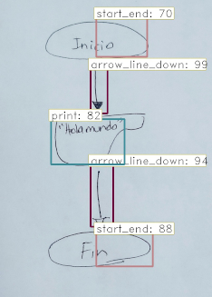
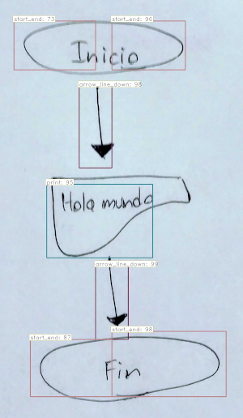
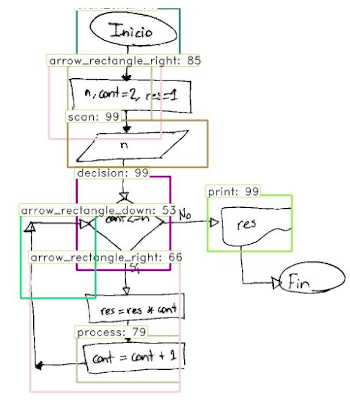
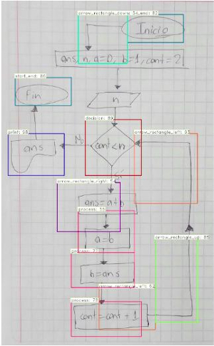
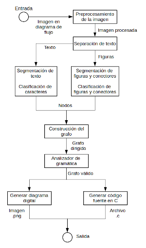
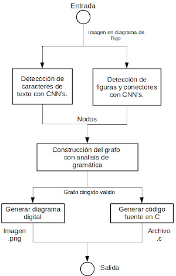
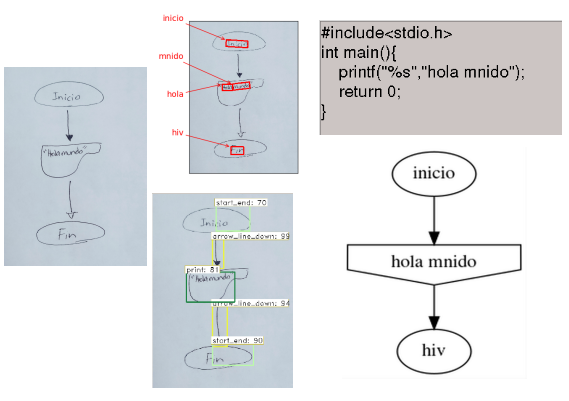

# Recognition of handwritten flowcharts with CNNs.
Recognition of handwritten flowcharts using convolutional neural networks to generate C source code and reconstructed digital flowchart.

Next, a brief evaluation report on the implemented system.

**Demonstration:** Generation of the digital image of the reconstructed flowchart and source code in C language.

**General aspects of the system**
* Dataset (shapes and arrows): [flowchart-3b v2](https://mega.nz/file/ce43iDSb#x4n6WiWK3HBEXdXu8YYEEObi92EwsNOlboDNrkmVEaY).
  - 13 classes, template photos of 12 handwritten symbols of each class.
* Object detection model (shapes and arrows): Faster R-CNN with VGG-16.
* Object detecion model (text): [Keras OCR](https://pypi.org/project/keras-ocr/).
* Keras with Tensorflow for the implementation of the deep learning models (convolutional neural networks).
* Graphviz for Python to generate the digital image of the diagram.
* [Requirements to install](https://drive.google.com/file/d/15uwCCZs8yFWHcfRW3c-Oh8RQjerPDWil/view?usp=sharing) the virtual environment in Conda.

**About training (model for shapes and connectors):**
- 500 epochs in a time of 6 hours.
- Software: Conda 4.7.12, Tensorflow 2.0.0, Keras 2.3.1, SO: GNU/Linux Ubuntu 18.04 LTS.
- Hardware: 16 GB RAM, 123 SSD, Intel core  i7-9700, GeForce GTX 1660.
- The best results were when using a pre-trained model to initialize the weights: [vgg16_weights_tf_dim_ordering_tf_kernels](https://github.com/fchollet/deep-learning-models/releases)

**Better results when making different variations on some hyperparameters**
id | variation | mAP | loss
------------ | ------------- | ------------ | -------------
1 | Default (view below) | 0.9852 | 0.3130
2 | Data augmentation:  use_horizontal_flips=True  use_vertical_flips=True| 0.9799 | 0.3271
3 | Anchors:  scales={64^2,128^2,256^2} ratios={2:1,1:1,1:2} | 0.9876 | 0.3576
4 | RoIs: 15 | 0.9818 | 0.3671
5 | RPN max overlap: 0.65 | 0.9839 | 0.3790
6 | Optimizer: RMSprop | 0.9706 | 0.3088

**Default hyperparameters**
- use_horizontal_flips = False
- use_vertical_flips = False
- epoch_lenght = 32
- learning_rate = 0.00001
- anchor_box_scales = (128, 256, 512)
- anchor_box_ratios = {(1, 1), (1./math.sqrt(2), 2./math.sqrt(2)), (2./math.sqrt(2), 1./math.sqrt(2))}
- min_image_side = 600
- img_channel_mean = (103.939, 116.779, 123.68)
- img_scaling_factor = 1.0
- num_rois = 32
- rpn_stride = 16
- std_scaling = 4.0
- classifier_regr_std = (8.0, 8.0, 4.0, 4.0)
- rpn_min_overlap = 0.3
- rpn_max_overlap = 0.7
- classifier_min_overlap = 0.1
- classifier_max_overlap = 0.5
- optimizer =  Adam

**How accurate is the best?**

[Download best model here](https://drive.google.com/open?id=1vqM2mkwkp9tNKybGvLD_LxCi01MzJufx)

The result with id equal to 3, had a better performance (0.9876) on the mAP metric in the validation dataset. The following table shows the AP by class:

CLass | AP
------------ | -------------
Arrow line up | 0.9301
Arrow line down | 0.9294
Arrow line left | 0.9787
Arrow line right | 0.9765
Arrow rectangle up | 0.9890
Arrow rectangle down | 0.9990
Arrow rectangle left | 1.0
Arrow rectangle right | 1.0
Start end | 0.9999
Process | 1.0
Decision | 0.9999
Print | 0.9999
Scan | 0.9976

**Detection testing**

Making a visual analysis of the detection of figures from the validation dataset, in general it is almost perfect, where you see more problems (although not serious) is with the rectangle arrows, up and down.

At the time of making tests with photos of handwritten flowcharts, detecting the elements is not enough to generate the valid directed graph and thus be able to generate the C source code and the digital image of the reconstructed diagram.

When making different detection tests, through visual analysis the result with id equal to 2 (mAP equal to 0.9799, having almost the lowest value but not with much difference from the best), presents the best results having tested with 3 diagrams of different algorithms ("Hello world", "Factorial of n" and "Calculation of the n-th element of the Fibonacci sequence").

Various tests were carried out varying 3 thresholds used in detection, which are:

- **overlap_thresh_1 = 0.9,** (convertir una rpn a una región de interés) para aplicar el non max supression fast cuando se hace la conversión de una RPN a RoI.
- **overlap_thresh_2 = 0.2** (para aplicar el non max supression fast en la salida), básicamente ordena y da prioridad a los bboxes de mayor confianza, y va eliminando los que tengan un IoU mayor a este umbral.
- **bbox_threshold = 0.51** Umbral para discriminar bboxes con confianza debajo del umbral, al aplicar el algoritmo de spatial pyramid pooling.

Here are some screenshots of the recognition results:

Of the tests carried out on the 3 types of diagrams, the "Hello world" diagram was the only one where a complete recognition of figures and arrows could be made.

One problem with this detection is that two detections are made in the same start_end symbol, covering up to half of it, on the other hand the bounding box of the print does not completely enclose it, in other tests with the "Hello world" not all symbols.

Preprocessed image of the flowchart for factorial calculation, not all symbols are recognized and in some cases there is confusion with the rectangular arrows.

Flowchart for the n-th term of the Fibonacci sequence, there are similar problems in those discussed when processing the factorial flowchart image.

**Detection tests (text):**
A Keras OCR using the main problems the process diagrams were:
- As characters are in the same text, if there is sufficient space between groups of them, then two detections are made, which can be solved by searching for proximity between the text detections.
- It only recognizes alphanumeric characters, which does not allow generating a C source code in diagrams whose represented algorithm uses special characters and / or mathematical symbols.
- Although it does locate the characters (text), it does not make an efficient enough classification, since for example, when trying to recognize "fin" it outputs "hiv".

**Pipeline:**

The previous pipeline is modified to generate the following version:

Notice that the image preprocessing and the text separation part have been removed, this is because before the construction of the pipeline there was a different recognition idea. but once there was more knowledge in the detection of objects, the way to achieve the same objective was changed.

**Complete test almost successful, diagram for the "Hello world":**

### Conclusions
* Of all the tests done, the “Hello world” has been partially successful.
* For the recognition of figures and connectors, the background is indifferent, and when tests were made with proprocessed (thresholdized) images, the grid and stripes are attenuated.
* The bounding box is not precise enough on rectangle arrows, process (elongated) and start_end, sometimes only half of the object is covered.
* Having the image preprocessed (thresholded) does little to improve object recognition, and in some cases makes it worse. For this reason, it was decided to remove it once the pipeline integration had been completed.
* Most of the confusing recognitions in handwritten flowcharts photos are with the rectangular arrows, since figures like the processes have lines perpendicular to each other.
* It's necessary to improve detection both in the text model as well as in that of figures and arrows.
